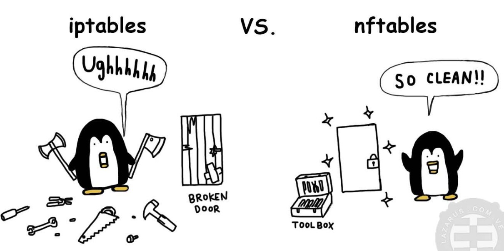
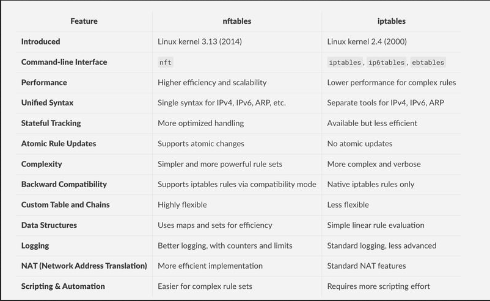
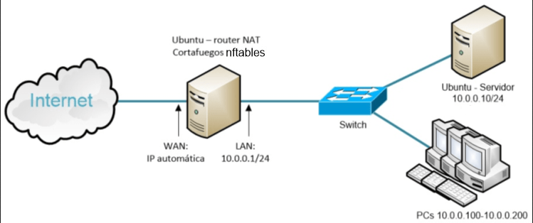

# NFTABLES


Nftables es un subsistema del kernel Linux y el sucesor moderno de iptables, desarrollado por el proyecto Netfilter. Este framework unificado de filtrado de paquetes representa una evolución significativa en la arquitectura de seguridad de red en Linux, proporcionando una infraestructura más eficiente y versátil para el filtrado, clasificación y manipulación de paquetes de red.
Como solución integral, nftables consolida la funcionalidad anteriormente distribuida entre múltiples herramientas (iptables, ip6tables, arptables y ebtables) en un único framework cohesivo. Esta unificación se logra a través de una interfaz de usuario común (nft) que simplifica significativamente la administración de reglas de red, mientras mantiene compatibilidad con la sintaxis heredada de iptables para facilitar la transición.


## Documentación oficial de nftables:

 [nftables](https://wiki.nftables.org/wiki-nftables/index.php/Main_Page)

**IPTABLES VS NFTABLES**



**Características clave:**
-  Arquitectura modular y extensible
-  Procesamiento de paquetes optimizado
-  Soporte nativo para IPv4 e IPv6- 
-  Sintaxis expresiva y consistente
-  Capacidades avanzadas de logging y debugging
-  Integración mejorada con el kernel Linux



A partir de Debian 10, nftables se establece como el framework predeterminado para el filtrado de paquetes, marcando una transición gradual pero definitiva desde las herramientas legacy de netfilter hacia esta solución más moderna y eficiente. En este sentido, nftables se convierte en una herramienta esencial para administradores de sistemas y redes que buscan mejorar la seguridad y el rendimiento de sus infraestructuras de red.

# ¿Que intenta mejorar nftables?

- Evitar duplicidad e inconsistencia en el código fuente.
- Muchas extensiones de iptables estaban duplicadas con pequeños cambiospara interactuar con diferentes protocolos.
- Simplificar usabilidad en entornos IPv4/IPv6.
- Mejorar actualizaciones al conjunto de reglas. Esta tarea en iptables es muy costosa y poco escalable.
- Mejorar la sintaxis.
- Mejorar el rendimiento.


# Instalación de nftables

```bash
# Instalar nftables
sudo apt install nftables

# Habilitar e iniciar el servicio
sudo systemctl enable nftables
sudo systemctl start nftables
```

# Configuración de nftables

```bash
# Crear tabla
sudo nft add table inet pruebas

# Crear cadena base
sudo nft add chain inet pruebas filter { type filter hook input priority 0 \; }
```

# Ejemplo Reglas de nftables

```bash
# Regla con DROP (puerto 80)
sudo nft add rule inet pruebas filter tcp dport 80 drop

# Regla con REJECT (puerto 21)
sudo nft add rule inet pruebas filter tcp dport 21 reject

# Regla con ACCEPT (puerto 22)
sudo nft add rule inet pruebas filter tcp dport 22 accept
```

# Listar y verficar

```bash
# Listar todas las reglas
sudo nft list ruleset

# Listar reglas con números de handle
sudo nft -a list ruleset

# Verificar sintaxis
sudo nft -c 'add rule inet pruebas filter tcp dport 80 drop' # Verificar regla
sudo nft -c -f /etc/nftables.conf # Verificar archivo
```

# Eliminar reglas

```bash
# Eliminar una regla específica
sudo nft delete rule inet pruebas filter handle X

# Limpiar todas las reglas de una cadena
sudo nft flush chain inet pruebas filter

# Eliminar todo
sudo nft flush ruleset
```

# Guardar reglas

```bash
sudo nft list ruleset > /etc/nftables.conf

# Cargar reglas desde archivo
sudo nft -f /etc/nftables.conf
```
# Logs de nftables

## Ver logs en tiempo real

```bash
# Ver todos los logs del kernel (donde aparecen los logs de nftables)
sudo tail -f /var/log/kern.log

# Filtrar solo los logs de nftables
sudo tail -f /var/log/kern.log | grep -i "nft"

# Filtrar por tu mensaje personalizado
sudo tail -f /var/log/kern.log | grep "mensaje_personalizado"

```

## Log personalizado

```bash
# Log con nivel de prioridad
sudo nft add rule inet mi_firewall filter \
    tcp dport 22 \
    log level info prefix \"SSH_INTENTO: \" \
    reject

# Log con flags adicionales
sudo nft add rule inet mi_firewall filter \
    tcp dport 80 \
    log flags all prefix \"HTTP_INTENTO: \" \
    reject
```
## Logs históricos

```bash
# Ver todos los logs anteriores
sudo grep -i "nft" /var/log/kern.log

# Ver logs de un día específico
sudo grep -i "nft" /var/log/kern.log.1
```
## Journalctl

```bash
# Ver logs en tiempo real
sudo journalctl -f | grep "nft"

# Ver logs del kernel relacionados con nftables
sudo journalctl -k | grep "nft"
```


# Comprobación de reglas

```bash
# Probar con nmap
nmap -p 80,21 [ip-objetivo]

# Probar con servicios específicos
ftp [ip-objetivo]
curl [ip-objetivo]
```

Para una configuracion avanzada, revisa el apartado de este repositorio para ello --> [Configuración avanzada](#configuración-avanzada.md)


Gracias por leer este documento, espero que te haya sido de ayuda. Si tienes alguna duda, no dudes en preguntar.


